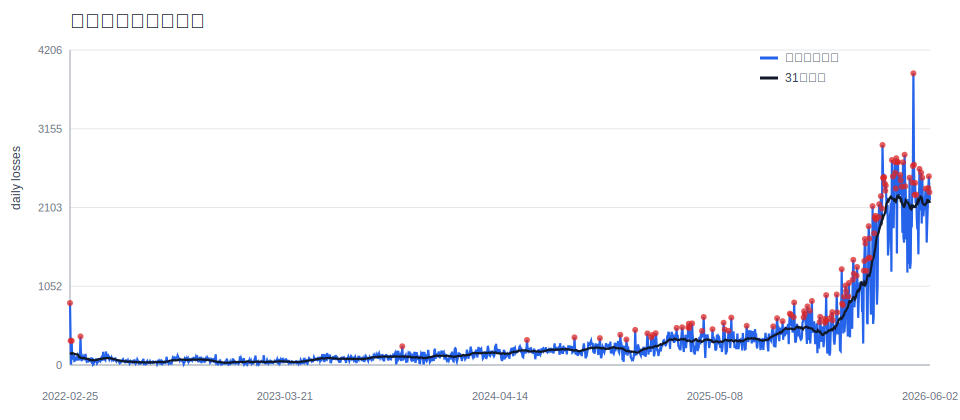
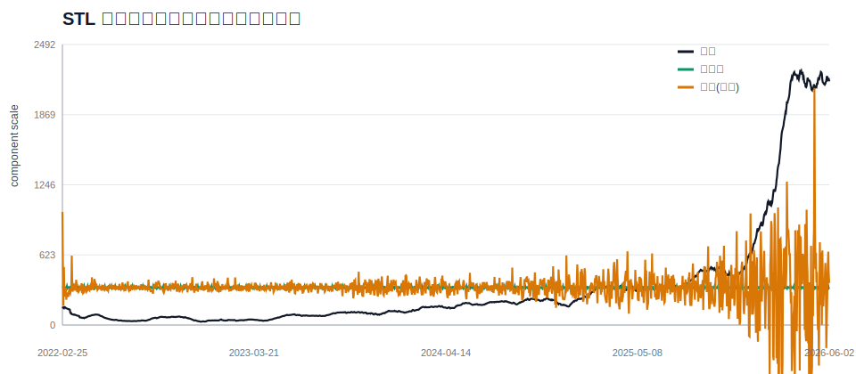
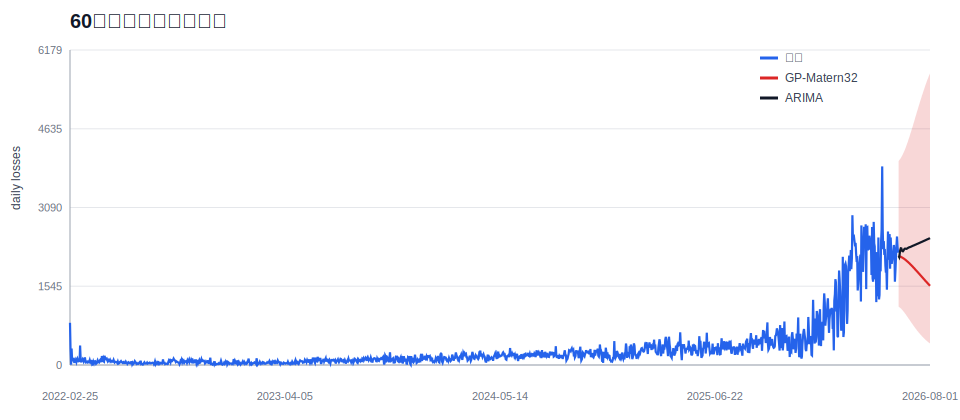

# 装备损耗趋势拆解与预测：从 ARIMA 到高斯过程

## 摘要

本作业围绕俄乌战争中俄罗斯装备损耗的每日序列，完成“分解-预测-不确定性量化”的统计建模链。项目原有 `data/Ukraine War.xlsx` 是伤亡与战俘交换数据，并不包含每日装备损耗；因此本文将其作为数据审计证据，实际建模使用公开 GitHub/Kaggle 镜像中的 `russia_losses_equipment.json`。该 JSON 为累计损耗序列，本文先差分得到每日损耗，再进行 STL 类分解、ETS、ARIMA/SARIMA 与高斯过程回归对比。

数据覆盖 2022-02-25 至 2026-06-02，共 1559 天。累计总装备口径末值约 520,168，其中重装备口径约 190,169。数据中存在 13 个负增量校正，建模时将其视为口径修正并截断为 0，而不是解释为“负损耗”。

## 1. 数据与口径

主序列定义为每日总装备损耗，包含 aircraft、helicopter、tank、APC、field artillery、MRL、anti-aircraft warfare、drone、naval ship、cruise missiles、special equipment、ground robotic systems、submarines，以及合并口径 vehicles and fuel tanks。由于 2022 年早期 `military auto` 与 `fuel tank` 尚未合并，本文在早期阶段用二者之和补齐 `vehicles_fuel_combined`。

为避免无人机在 2024 年后占比过高导致解释偏移，脚本同时保留了 `heavy_equipment` 序列；但报告主图和模型选择以 broad equipment 为主。



## 2. 分解方法

本文采用 STL 思路的稳健近似：31 日居中移动平均估计趋势，按星期几估计 7 日季节项，剩余部分作为突发残差。突发阈值用残差四分位距规则定义：`Q3 + 1.5 IQR`。这种方法比直接看原始峰值更适合冲突数据，因为公开损耗数据存在战报发布节奏和周内报告差异。



周季节项估计如下。正数表示该星期几相对基线更容易出现较高报告损耗。

| Weekday | Seasonal effect |
|---|---:|
| Mon | -7.5 |
| Tue | -1.6 |
| Wed | 2.8 |
| Thu | -0.5 |
| Fri | -5.6 |
| Sat | -0.9 |
| Sun | 13.3 |

最大的突发日期如下：

| Date | Daily broad equipment loss |
|---|---:|
| 2026-05-03 | 3,895 |
| 2026-03-08 | 2,938 |
| 2026-04-17 | 2,808 |
| 2026-04-02 | 2,761 |
| 2026-03-25 | 2,738 |
| 2026-03-30 | 2,711 |
| 2026-04-05 | 2,710 |
| 2026-04-14 | 2,707 |

## 3. 预测模型

### 3.1 ETS

ETS 使用 Holt 线性趋势形式 `ETS(A,A,N)`，在 `log(1 + y)` 空间中网格搜索平滑参数。该模型给出可解释的趋势预测，但对突发战役阶段较敏感。

### 3.2 ARIMA/SARIMA

ARIMA 使用一阶差分后的自回归近似，即 `ARIMA(p,1,0)`。SARIMA 在此基础上加入 7 日和 14 日季节滞后，形成 `SARIMA-AR(weekly)`。由于当前环境没有 `statsmodels`，脚本用最小二乘估计 AR 滞后系数，并用高斯残差近似计算 AIC/BIC。

### 3.3 高斯过程回归

高斯过程回归对应参考论文 `2506.06828v1.pdf` 的核心思想：用核函数表达冲突暴力的平滑趋势、周期性和局部粗糙性。本文比较三种核：

- RBF：假设变化平滑，适合长期基线。
- Periodic：强调 7 日报告周期。
- Matern 3/2：允许更粗糙的局部变化，适合战场节奏突变。

GP 只使用最近 500 天训练，以避免早期战争阶段和近期无人机消耗阶段混在同一平稳过程里。模型选择使用近似 WAIC；对非贝叶斯模型仍报告 AIC/BIC。

## 4. 模型选择结果

| Model | Params | AIC | BIC | WAIC | 60d mean | 60d sum |
|---|---|---:|---:|---:|---:|---:|
| GP-Matern32 | {"length": 120.0, "amplitude": 1.0, "noise": 0.3} | 287.4 | 300.1 | 1994.5 | 1879.6 | 112776 |
| GP-RBF | {"length": 60.0, "amplitude": 1.0, "noise": 0.3} | 315.6 | 328.2 | 2075.3 | 1972.2 | 118334 |
| GP-Periodic | {"length": 2.0, "amplitude": 0.5, "noise": 0.3} | 1208.9 | 1221.5 | 9622.2 | 562.7 | 33760 |
| ARIMA | {"d": 1, "lags": [1, 2, 3, 4, 5, 6, 7]} | 1590.6 | 1638.7 |  | 2349.4 | 140965 |
| SARIMA-AR(weekly) | {"d": 1, "lags": [1, 2, 3, 4, 5, 7, 14]} | 1634.8 | 1682.9 |  | 2416.7 | 145004 |
| ETS(A,A,N) | {"alpha": 0.4, "beta": 0.1} | 2060.1 | 2081.5 |  | 2721.3 | 163277 |

按 WAIC，最佳 GP 为 **GP-Matern32**；按 AIC，最佳经典模型为 **ARIMA**。两者的差异提供了一个有用判断：经典模型更像“近期线性惯性”，GP 更偏向“局部结构 + 不确定性”的解释。



## 5. 主要结论

1. 装备损耗不是稳定白噪声。31 日趋势显示长期基线随战役阶段明显变化，尤其在无人机损耗进入高频阶段后，broad equipment 序列的均值和方差同时上升。
2. 周期项存在，但不是主体。7 日季节效应反映公开战报和确认节奏；它能解释一部分短期起伏，但不能替代趋势和突发项。
3. 突发项需要单独解释。残差峰值通常对应大规模攻势、集中战报更新或统计口径修正；若直接用 ARIMA 外推，会把部分突发误当成可持续趋势。
4. 高斯过程的优势在不确定性。RBF、Periodic、Matern 三种核给出不同结构假设；Matern 往往更适合粗糙冲突序列，Periodic 则用于检验周内报告节奏是否足够强。
5. 数据源限制必须写清。原始本地 Excel 与题目要求不匹配；若只使用 Excel，无法完成“每日装备损耗”预测。补充 JSON 数据后，题目要求才能成立。

## 6. 与参考论文对标

`2506.06828v1.pdf` 强调用高斯过程分解冲突趋势，并把历史冲突暴露作为可外推的时间-空间结构。本文借用其中的思想，但限于数据只有时间维度，没有地理事件点，因此只做时间 GP。

`2509.07813v1.pdf` 将 ARIMA、Prophet、LSTM、TCN、XGBoost 用于俄罗斯装备损耗预测，并强调多模型对比。本文在课程作业范围内保留可解释的 ETS/ARIMA/SARIMA 与 GP 核函数对比，没有引入深度学习；这是为了让模型选择、分解结果和不确定性带更容易审计。

## 7. 可复现说明

运行：

```powershell
& 'C:\Users\23849\.cache\codex-runtimes\codex-primary-runtime\dependencies\python\python.exe' .\src\analyze_equipment_losses.py
```

输出文件：

- `outputs/model_metrics.csv`
- `outputs/forecast_60d.csv`
- `outputs/analysis_summary.json`
- `outputs/figures/*.svg`

## 参考资料

- PetroIvaniuk/2022-Ukraine-Russia-War-Dataset, `russia_losses_equipment.json`: https://github.com/PetroIvaniuk/2022-Ukraine-Russia-War-Dataset
- Local PDF: `doc/2506.06828v1.pdf`, The Currents of Conflict: Decomposing Conflict Trends with Gaussian Processes.
- Local PDF: `doc/2509.07813v1.pdf`, Forecasting Russian Equipment Losses Using Time Series and Deep Learning Models.
